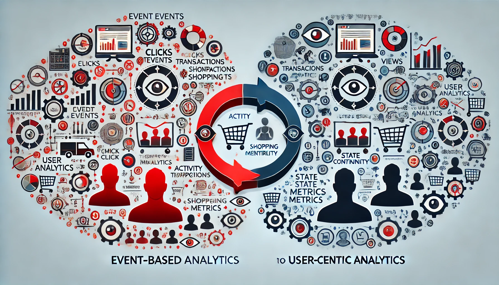
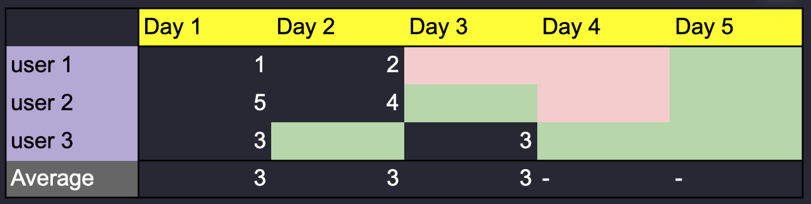
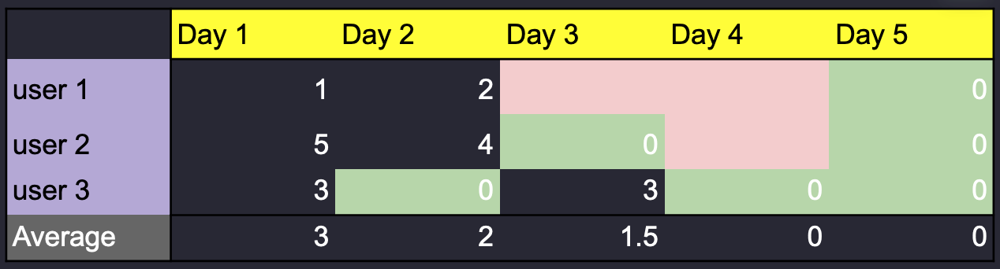

# Why Events For User Analytics?

{.responsive-image}

In the evolving landscape of product analytics, events have traditionally been the foundation for tracking user behavior. Every interaction—clicks, page views, transactions—gets logged as a discrete event. But is this granular tracking actually creating unnecessary complexity when what matters most is understanding user behavior and metrics at the user level? Let's explore why events might not be the ideal foundation for user analytics and discover a more effective approach.

## The Event-User Mismatch

Product teams consistently focus on user-centric questions:

- How many active users do we have?
- What's our user retention rate month over month?
- Which user segments drive the highest revenue growth?
- How does user engagement evolve throughout the customer lifecycle?

Notice the pattern? These questions center around users, not events. Yet our analytics infrastructure forces us to construct these user-centric metrics from event-level data, creating a fundamental disconnect between business thinking and data structure.

## The Hidden Complexity of Event Analytics

Event-based analytics introduces several layers of complexity that impact both performance and usability:

### 1. Aggregation Overhead

Every user-level metric requires complex event aggregation:

- Active user status? Count events within a time window
- Customer lifetime value? Sum transaction events over time
- Engagement score? Weighted calculations across multiple event types

This constant need for aggregation doesn't just add computational overhead—it makes metrics harder to define, maintain, and trust.

### 2. Temporal Challenges

{.responsive-image height=100}
*Event aggregation creates gaps in user behavior tracking (gray: event aggregated value, red: inactive, green: active)*

{.responsive-image height=106}
*User-property tracking maintains continuous state visibility (gray: user property value, red: inactive, green: active)*

Events represent moments in time, but user behavior exists on a continuum. Understanding behavior changes over time requires complex window functions and date-based aggregations that often become performance bottlenecks.

### 3. State Management Complexity

Users maintain persistent states between events (like "premium subscriber" or "churned"), but event data doesn't naturally capture this continuity. This forces teams to build complex state management systems, turning simple metric changes into month-long development cycles.

## Bridging the Gap: The User-Action Entity Model

What if we flipped the script and structured analytics around users first, while maintaining event granularity when needed? This user-centric approach delivers multiple benefits:

1. **Business Logic Alignment**
   - Matches how product teams think about metrics
   - Simplifies stakeholder communications
   - Accelerates decision-making processes

2. **Analysis Simplification**
   - Makes common queries intuitive
   - Reduces analysis complexity
   - Improves metric consistency

3. **Performance Optimization**
   - Minimizes repeated aggregations
   - Improves query response times
   - Reduces computational overhead

4. **Enhanced Flexibility**
   - Maintains event-level detail access
   - Supports custom analysis needs
   - Enables rapid iteration

## A Better Way Forward

Consider tracking user engagement in both systems:

**Traditional Event-Based Approach:**
```sql
SELECT 
    user_id,
    DATE_TRUNC('day', event_time) as day,
    COUNT(*) >= 1 as is_active
FROM events
WHERE event_type IN ('view', 'click', 'purchase') // Only these?
GROUP BY 1, 2
```

**User-Centric Approach:**
```sql
SELECT 
    user_id,
    date,
    is_active
FROM user_daily_states
```

The user-centric model dramatically simplifies answering common questions. The benefit of the user state model is that it can be now used with 

## Rethinking Product Analytics

Shifting from event-centric to user-centric analytics transforms how teams work with data:

- **Intuitive Metric Definition**
  - ARPDAU becomes a simple division of revenue by active users
  - Retention calculations work directly with user states
  - Cohort analysis uses natural user groupings

- **Simplified Analysis Construction**
  - Faster query development
  - Reduced error potential
  - Better performance characteristics

- **Improved Business Alignment**
  - Metrics match business concepts
  - Faster stakeholder communication
  - More reliable reporting

## Looking Ahead

The future of product analytics isn't about collecting more events—it's about building better abstractions that help us understand user behavior intuitively. The most effective analytics solutions will bridge the gap between event-level detail and user-level insights, providing both granularity and simplicity.

### Key Takeaways
- Event-based analytics create unnecessary complexity
- User-centric models align better with business goals
- Simplified analysis leads to faster insights
- Performance improvements come naturally
- Future tools need better abstractions

---

*This post is part of our [Modern Product Analytics series](/blog/series/modern-product-analytics). For more insights on building better analytics systems, [subscribe to our newsletter](/newsletter) or [contact us](/contact) to learn how Asemic can transform your product analytics.*

**Related Posts:**
- [Building Scalable Analytics Infrastructure](/blog/scalable-analytics-infrastructure)
- [User Behavior Analysis Best Practices](/blog/user-behavior-analysis)
- [The Future of Product Analytics](/blog/future-product-analytics)

[Download our User-Centric Analytics Implementation Guide →](/resources/user-centric-analytics-guide)
