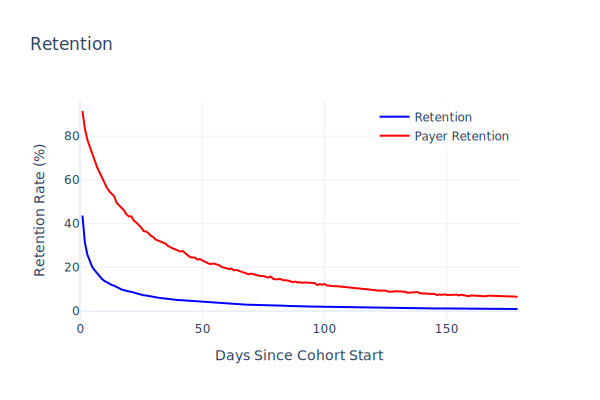
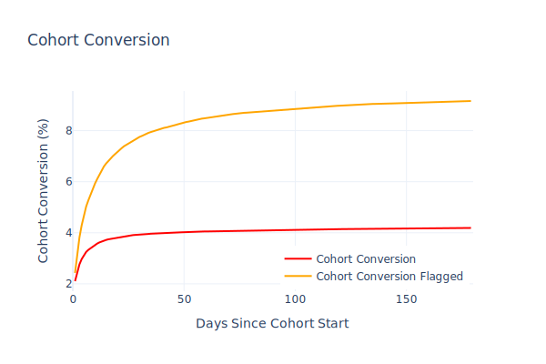

# Modeling User Behavior Metrics in Freemium | Part 1

## The Hidden Truth Behind Payer Retention

In the world of freemium products, we often celebrate when paying users show significantly higher retention rates than non-payers. But is this truly because they're more committed after spending money, or is something else at play? This post explores a common misconception in product analytics and offers a data-driven perspective that might change how you interpret your retention metrics.



## The Data Analytics Secret

Raw data alone doesn't tell a story. Without an interpretive framework—a good model—data remains just numbers on a screen. Most of us carry these models implicitly in our heads, but real insights emerge only when we make them explicit and challenge our assumptions.

## Understanding Metric Relationships

Product teams often use "Metric Trees" to visualize how different metrics relate to each other. While simplistic (like the Bohr model of the atom), they're useful for seeing clear mathematical relationships:

```
ARPDAU  = Daily Purchase Rate × ARPPU
Revenue = ARPDAU × DAU
```

These relationships help us understand which levers affect our key business outcomes, but they don't produce valid models for more complex metrics.

## The Payer Retention Puzzle

In freemium products, paying users typically show dramatically higher retention rates compared to the general user population. This pattern is so reliable that many product strategies focus on converting users quickly, operating under the assumption that payment itself increases commitment.

Most teams attribute this to psychological factors:
- **Sunk cost fallacy**: "I've spent money, so I should keep using it"
- **Anchoring**: Setting a monetary value on the product experience
- **Commitment bias**: The act of paying signals higher investment

But what if there's a simpler explanation?

## The Data Modeling Issue

Before diving deeper, let's clarify two important types of user segments:

- **Static segments**: Fixed groups of users (e.g., all users who registered in January)
- **Dynamic segments**: Groups that change as users meet certain criteria (e.g., all current subscribers)

When comparing general retention with payer retention, we're often comparing a static segment (all registrants) with a dynamic one (users who convert to paying at different times). This distinction matters tremendously.

## Selection Bias vs. Psychological Factors

While psychological biases make for compelling explanations, we shouldn't overlook a more fundamental factor: **selection bias**. 

Think about it: to become a payer, a user must first be active in your product. This creates an inherent selection bias—the very action of being present to make a purchase indicates higher engagement than users who aren't active at all.

## A Simple Experiment

To test how much of payer retention is explained by selection bias rather than psychological factors, I designed a straightforward experiment:

1. Measure the actual daily conversion rate `p[d]` (probability of spending on day d after registration)
2. Instead of looking at actual payers, randomly "flag" active users each day with the same probability
3. Compare the retention curves of these "flagged" users against general retention

The results were striking:


Even when randomly flagging users (with no actual purchase or psychological commitment), the retention curve closely resembles that of actual paying users. 

To validate further, I even removed actual payers from the pool before random flagging—the pattern held steady.

## What This Means For Your Product Strategy

This experiment reveals that a significant portion of the "payer retention advantage" comes simply from selection bias—we're measuring a group that, by definition, had to be active to enter the segment.

However, looking at the cohort conversion chart below, it's clear that user purchase behavior isn't entirely random. There's more to the story:



## Beyond The Surface Metrics

This finding doesn't mean you should abandon efforts to convert users early. But it does suggest we should be more careful about attributing retention improvements solely to the psychological effects of payment.

Understanding the statistical underpinnings of your metrics can prevent false conclusions and help you:

1. Build more accurate forecasting models
2. Design more effective experiments
3. Focus on the true causal factors driving retention

## What's Next?

In Part 2 of this series, I'll introduce a more comprehensive model for understanding user behavior in freemium products—one that accounts for both selection effects and genuine engagement factors.

Rather than relying on surface-level metrics, we'll explore how to disentangle correlation from causation in user behavior, leading to more effective product and marketing strategies.
