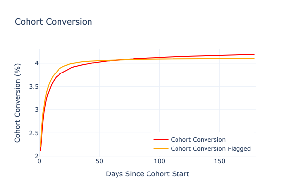

# Modeling User Behavior Metrics in Freemium | Part 2

  

    
  

  

    <a href="https://www.linkedin.com/in/marko-jevremovic-6b77471a/" style="text-decoration:none;">
      MARKO J
    </a>
    March 7, 2025
  

---

{height=400px}

## Building a Predictive Model of User Behavior

In Part 1, we explored the surprising role of selection bias in payer retention metrics. We discovered that much of the retention advantage paying users display isn't due to psychological commitment but simple statistics: users must be active to make a purchase in the first place.

But the story doesn't end there. While our random flagging experiment demonstrated selection bias at work, the data shows patterns that random selection alone can't explain. Today, we'll build a more sophisticated model that helps explain what's really happening beneath the surface of our metrics.

{height=300px} {height=300px}

## The Dual-Propensity Model

To better understand user behavior, I've developed what I call the "Dual-Propensity Model." This model is built on two fundamental user characteristics:

1. **Engagement Score**: A measure of a user's inherent tendency to engage with the app
2. **Payment Propensity**: A measure of a user's willingness to spend money

The key insight is that these two characteristics are related but distinct. Some highly engaged users may never pay, while some users with moderate engagement might be quick to purchase.

## The Math Behind the Model

Our model uses the following 4 parameters parameters:

### Engagement score

If we suppose there's an inherit Egagement score that describes a user's propensity to engage with an app, it should be a good predictor of their long-term activity. Conversely, we can simply use long-term activity to calculate engagement score. Simplest model (that works) is calculating total Screen Time (time spent in the app) for the users in a dataset within some period after the registration and then simply setting Engagement to percentile rank. We can also use combination of Retention and Screen Time.

### Payment Propensity

We'll introduce Payment Propensity analogly to Engagement. Now, the problem with Payment Propensity is that it can't be easily calculated from given data and the extent of problems will be shown later. But, what we can do in this pseudo-simulation is to arbitrarily assign Payment Propensity to each user. 

### Behavior Correlation

- `corr`: The correlation between engagement score and payment propensity (ranging from 0 to 1)

With `corr` correlation factor we can influence if we want to set it to be identical to Engagement, or completely random sampled from uniform distribution, or anything in between. As we are not interested in individual users, but group behavior, it can be shown that this approach works on a large enough sample.

### Payment Pool

- `cutoff`: A threshold that determines which users from the engagement distribution become potential payers

For each user, we calculate:

1. An engagement score (determining their retention likelihood)
2. A payment propensity score (partially correlated with engagement)
3. Whether they're in the "payment pool" based on the cutoff value

## Testing Model Scenarios

Let's examine how different parameter combinations affect our metrics by testing several scenarios.

### Scenario 1: Uncorrelated Payment Behavior (corr = 0)

If payment propensity is completely random and unrelated to engagement (corr = 0), we should see:

{height=300px} {height=300px}

In this scenario:
- Flagged user retention is better than average retention
- But it's significantly worse than actual payer retention
- The cohort conversion curves' shape is slightly off compared to reality

This tells us that payment behavior isn't entirely random. There must be some connection to engagement.

### Scenario 2: Buyers are Hyperactive (corr = 1)

What if payment propensity perfectly correlates with engagement? In this case:

{height=300px} {height=300px}

Here we find:
- Flagged users have extraordinarily high retention (>90% in the first month)
- The retention curve shape differs dramatically from actual payer retention
- The cohort conversion pattern perfectly matches observed data

This scenario doesn't reflect reality either, suggesting payment behavior isn't simply a direct function of engagement.

## Finding the Best Model Fit

Through model fitting and optimization, we discovered that the best explanation for real-world data uses:

- A correlation (`corr`) of approximately 0.445 between engagement and payment propensity
- A cutoff value (`cutoff`) of about 0.843

{height=300px} {height=300px}

This moderate correlation tells us something important: while more engaged users are indeed more likely to pay, there's still significant variation that engagement alone doesn't explain.

## Daily Purchase Rate: A Fundamental Metric

Our model suggests that Daily Purchase Rate is more fundamental than metrics like conversion rate. It stabilizes over time and represents a systemic response of the app-user ecosystem at scale.

{height=300px}

The similarity between the actual Daily Purchase Rate and our model's Daily Flagged Rate validates our approach and confirms we're capturing the essential dynamics of user behavior.

## Practical Applications

There are several immidiate conclusions that this model points to.

### 1. Selection Bias

Selection Bias creates strong effect. In the end we've settled to `cutoff = 0.843`. This means that potential pool of payers is around 16%, yet only slightly more than 4% converted within 6 months. This implies that we are partly "paying" for high Payer Retention by not converting many potential payers who churn due to lower engagement before they hit the conversion point.

### 2. Engagement <-> Payment

There's a common wisdom that spending increases users engagement substantially. We've shown here that this is mostly an illusion created by selection bias, but not only that - we've gotten amazing fit without introducing any change in engagement from the value set at start.

Somewhat mismatched shape of Cohort Conversion does imply this effect exists as well and we'll add it in future iteration of this model, but it is also clear it is very small and shows visible change on a timescale of months, not immidiatelly.

### 3. Suprisingly low correlation

Correlation between Engagement and Payment Propensity is at the level of 0.4~0.5 for all the datasets I tested it, which was very surprising to me.

## Practical Implications

In the first place this model provides a correct way how to think about User Journey and how to correctly develop a strategy for different Engagement / Payment Propensity segments. 

It also enables to connect previously disparate metrics when making a decision and enables testing different monetization strategies not on a level of a single metric, but in a space of metrics that these parameters produce, with much deeper understanding of achieved effects.

## What's Next?

In the following blogs we'll explore some properties of the model in more detail.