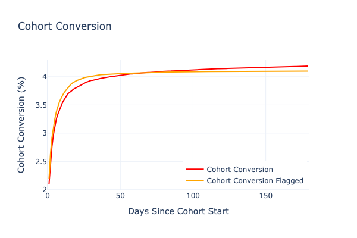
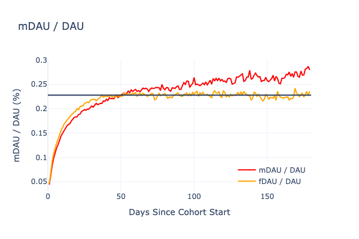

# Measuring Monetization Impact on Engagement: A New Approach

{height=400}

## The Key Metric You're Probably Missing

In the previous parts of this series, we explored how selection bias influences payer retention and introduced our dual-propensity model to explain user behavior in freemium products. Today, we'll tackle one of the most challenging questions in product analytics: **Does monetization actually impact user engagement?**

For years, product teams have struggled with this question. The typical approach looks at metrics like retention curves or average session lengths, comparing paying and non-paying users. But as we've already established, these comparisons are fundamentally flawed due to selection bias.

What we need is a metric that can directly measure the impact of monetization on engagement, independent of the selection effects we've discussed. Enter the **Monetized Daily Active User ratio (mDAU/
DAU)**.

{height=300}

{height=300}

## Understanding mDAU/DAU

The mDAU/DAU ratio measures the proportion of your daily active users who have previously made a purchase. What makes this metric particularly valuable is how it evolves over time.

As shown in the chart above, we can observe several key patterns:

1. **Initial growth period**: The ratio starts low and grows rapidly as new payers are added - it matches the period of steep growth of Conversion curve
2. **Stabilization period**: After the Conversion curve stabilizes influx of new payers is very low, but non-payers with lower engagement start churning away
3. **Long-term trend**: After this we see a gradual upward trend in real data and complete flattening in model prediction - this difference show the real (slow) increase of payer engagement.

For comparison, I've also plotted the "flagged" DAU ratio (fDAU/DAU), which represents our model's prediction based on random flagging with the optimized parameters. In individual cases first two phases can have different length depending on the particular app that's analyzed.

## Why This Metric Matters

The difference between these two curves is profound. It represents the actual impact of monetization on user engagement, isolated from selection bias effects. In other words:

- The fDAU/DAU line shows what we would expect purely from selection effects
- The mDAU/DAU line shows what actually happens in the real world
- The gap between them represents the true engagement impact of monetization

Looking at our data, we can see that monetization appears to provide positive impact on their activity. The horizontal line at around 22.8% on the chart represents the long-term stabilization point of the fDAU/DAU ratio in our model. The fact that the actual mDAU/DAU ratio consistently exceeds this level suggests that monetization does indeed have a positive impact on engagement.

This is the clearest measure I've found of monetization's impact on engagement. 

However, this impact is substantially smaller than what you'd conclude by naively comparing retention curves. Remember our findings from [Modeling User Behavior Part 2](modeling-user-behavior-in-freemium-part-2.md): paying users demonstrated retention rates 2-5x higher than non-payers. Our derived metric suggests the true engagement impact is much more modest.

## Implications for Product Strategy

Consequently, it can happen that after a while `mDAU / DAU` ratio stabilizes and even starts dropping. This can happen for multiple reasons: bad experience, burning through content too quickly, underwhelming experience, technical problems etc, but `mDAU / DAU` will provide unbiased signal that **something** is a problem that should be addressed.

## Beyond the Averages

While the aggregate mDAU/DAU ratio gives us a high-level view, the real power comes from segmentation. Consider analyzing how this ratio varies across:

- User acquisition channels
- Geographic regions
- Device types
- Feature usage patterns

These segmented views can reveal where monetization is having the greatest positive impact on engagement, allowing you to double down on successful strategies and rethink approaches that aren't working.

It is easy to create both `mDAU / DAU` metric and to deeply segment user-base using [Asemic](https://asemicanalytics.com/). 

## Conclusion: The True Value of Monetization

Our analysis suggests that monetization does provide a modest but real boost to user engagement, beyond what would be expected from selection effects alone. This confirms what many product leaders intuitively believe, but with a much more nuanced understanding of the magnitude.

Rather than seeing monetization as transformative for engagement (as a naive reading of retention curves might suggest), we should view it as a gentle enhancer of already-engaged users. This perspective leads to more effective product and monetization strategies that align with actual user behavior patterns.

I encourage you to start tracking your mDAU/DAU ratio and see what it reveals about your product's monetization impact on engagement or reach out to check how we can help you reveal deeper insights about your product.
