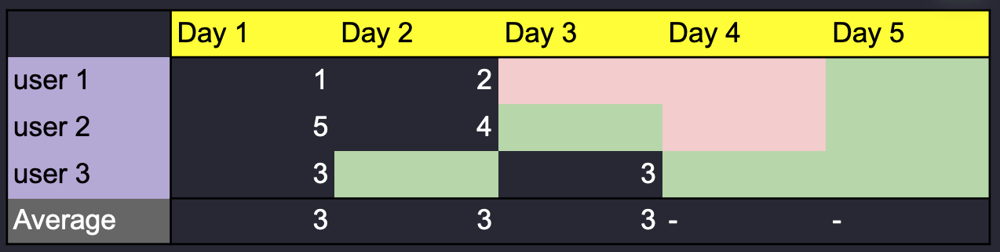
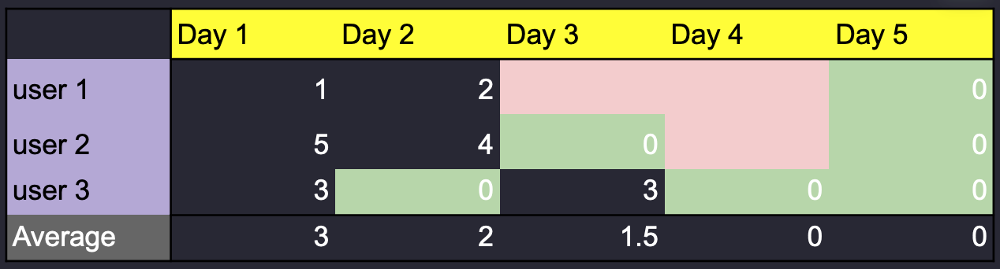

# Why events for user analytics?

In the world of product analytics, events have become the de facto standard for tracking user behavior. Every click, every page view, every transaction gets logged as a discrete event. While this granular tracking provides a wealth of data, it often creates unnecessary complexity when what we really care about is understanding user behavior and metrics at the user level. Let's explore why events might not be the ideal foundation for user analytics and how we can bridge this conceptual gap.

## The Event-User Mismatch

Think about the typical questions product teams ask:
- How many active users do we have?
- What's our user retention rate?
- Which user segments generate the most revenue?
- How does user behavior change over time?

Notice something? These questions are all about users, not events. Yet our analytics infrastructure forces us to build these user-centric metrics from event-level data, creating a fundamental mismatch between how we think about our business and how we structure our data.

## The Hidden Complexity of Event Analytics

When we use events as our primary data model, we introduce several layers of complexity:

### 1. Aggregation Overhead

Every user-level metric requires aggregating events first. Want to know if a user is active? You need to count their events. Want to calculate their lifetime value? You need to sum up their transaction events. Over time. And have the value on days when there's no event. This constant need for aggregation not only adds computational overhead but also makes metrics harder to define and maintain.

### 2. Temporal Challenges

Events are point-in-time occurrences, but user behavior exists on a continuum. Understanding how a user's behavior changes over time requires complex window functions and date-based aggregations. Questions like "Break down DAU by how many days were they active last week?" become surprisingly complex SQL queries when working with raw events. 

{height=100}
(gray: __event aggregated value__, red:inactive, green: active, no event)

{height=106}
(gray: __user property value__, red:inactive, green: active, no event)

### 3. State Management

Users have states that persist between events (like "premium subscriber" or "churned"), but event data doesn't naturally capture this continuity. We end up building complex state management systems on top of our event data to track these user-level attributes. Changing the definition starts a month long development cycle.

## Bridging the Gap: The User-Action Entity Model

What if we could structure our analytics around users first, while still maintaining the granularity of event data when we need it? This is where a user-centric data model becomes valuable.

Instead of starting with events and building up, we can start with users and their properties, treating events as inputs to a more intuitive user-level model. This approach:

1. **Matches Business Logic**: Aligns with how product teams actually think about their metrics and users
2. **Simplifies Analysis**: Makes common user-level queries straightforward and intuitive
3. **Improves Performance**: Reduces the need for repeated complex aggregations
4. **Maintains Flexibility**: Still allows drill-down to event-level detail when needed

## A Better Way Forward

Consider a simple example: tracking user engagement. In an event-based system, you might need to:
1. Count daily events per user
2. Apply activity thresholds
3. Calculate rolling windows
4. Join across multiple event types
5. Handle edge cases and data gaps

With a user-centric model, this becomes much simpler. Users have properties that directly reflect their engagement state, updated as events occur but stored at the user level. The complex event processing still happens, but it's handled automatically by the data model, not manually in every analysis.

## Rethinking Product Analytics

The shift from event-centric to user-centric analytics isn't just about technical architecture—it's about aligning our tools with our goals. When we build our analytics systems around users first:

- Metrics become more intuitive to define
ARPDAU is as simple as dividing two sums: sum of revenue property and sum of 0/1 daily active indicator
- Analyses become easier to construct
We can think about user groups and metrics independantly
- Performance improves naturally
User State model becomes sort of a cache of pre-aggregated events
- Business questions get answered faster
Model is centered around business concepts and easier to use for both analysts and business people alike

Events still play a crucial role as the atomic units of user behavior, but they shouldn't be the primary lens through which we view our data. By elevating our analysis to the user level, we can build more intuitive, performant, and maintainable analytics systems that better serve our needs.

## Looking Ahead

As product analytics continues to evolve, we need tools and frameworks that match how we think about our users and businesses. The future of product analytics isn't about collecting more events—it's about building better abstractions that help us understand user behavior more intuitively.

The most powerful analytics solutions will be those that can seamlessly bridge the gap between event-level data and user-level insights, providing the granularity of events when needed while maintaining the simplicity and intuition of user-level analysis.

---

*This post is part of our series on modern product analytics. For more insights on building better analytics systems, follow our blog or reach out to learn how Asemic can help transform your product analytics.*
